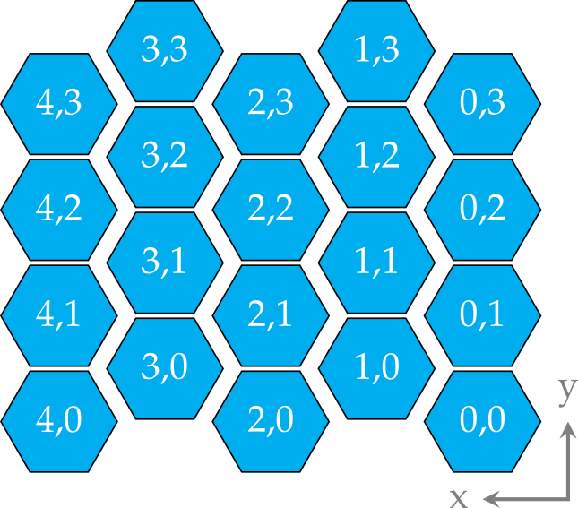

    
- # Definition  
	- ## 2D Index  
		-   
	- ## 1D Index  
		-   
		-  
- # Logic  
	- ## GDScript  
		-  
		  ``` gdscript
		  			  # Conversion single array index to dual array index
		  			  # c -> x,y
		  			  # x = c % maxWidth
		  			  # y = c / maxWidth # normal integer division
		  			  # y = c / (maxWidth - c % maxWidth) 
		  			  func from_1D_to_2D(index : int) -> Vector2:
		  			  	var x : int = index % self._width
		  			  	var y : int = index / self._width
		  			  
		  			  	return Vector2(x,y)
		  			  
		  			  # Conversion of dual array index to single array index
		  			  # x, y -> c
		  			  # x + y * maxWidth = c
		  			  func from_2D_to_1D(index2D : Vector2) -> int:
		  			  	return int(index2D.x) + int(index2D.y) * self._width
		  ```