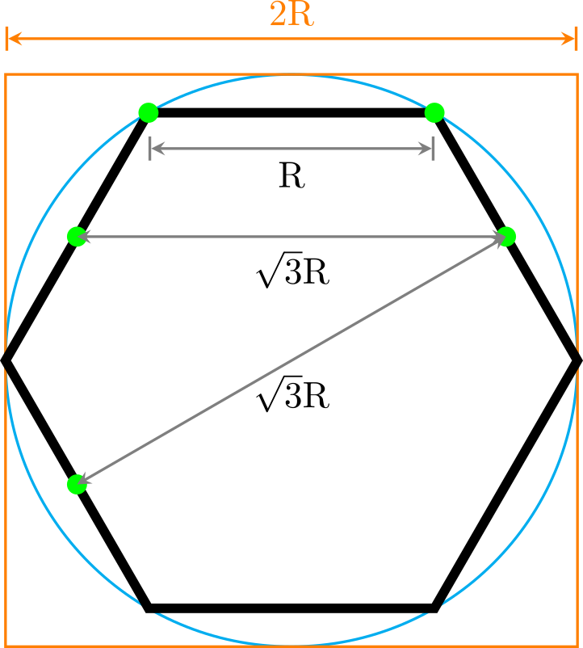
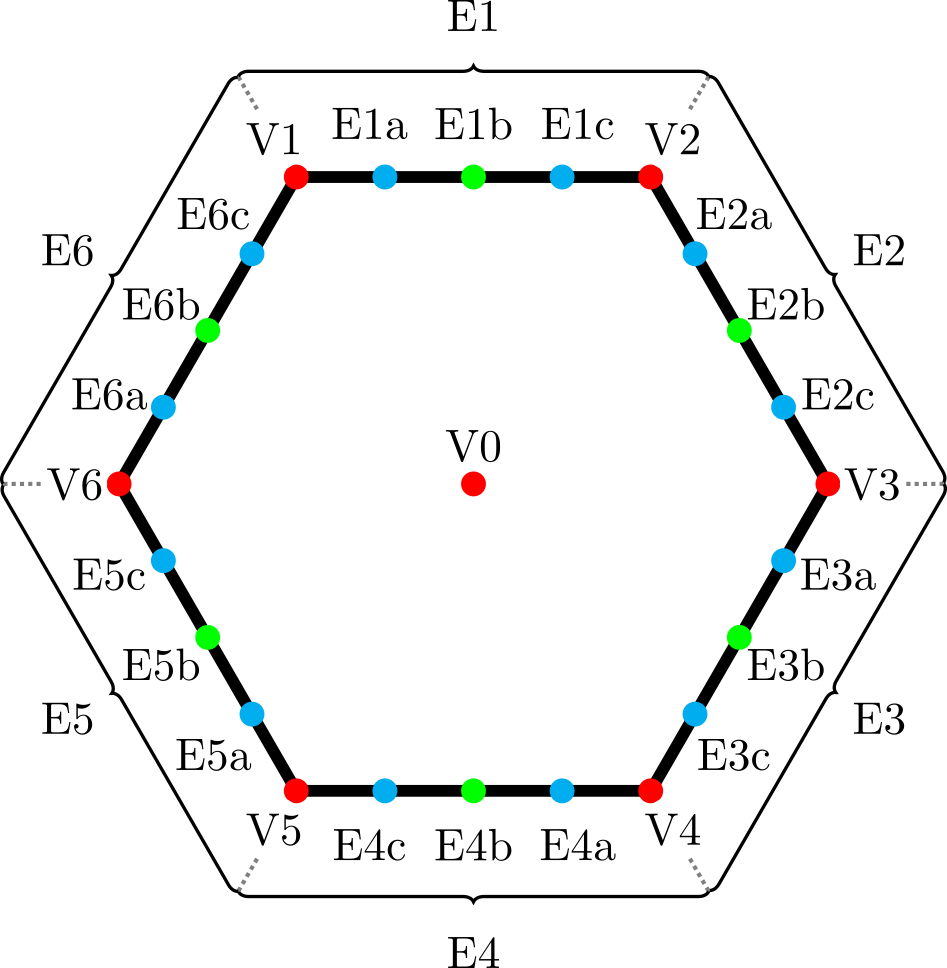

# Coordinate System and Edge Definition  
	## Hexagonal Tile: Dimensions  
		
	## Hexagonal Tile: Coordinate System and Edge Definition  
		
	 
	## Edge Types  
		### Landscape
			- `grass`  
				- Matches: `grass`, `forest`, `field`, `mountain`, `lake`  
				- Conflicting: `stream`, `river`, `railroad_single`, `railroad_double`, `dirt_track`, `road_single`, `road_double`, `town_square`, `settlement`  
			- `forest`  
			- `field`  
			- `mountain`  
		### Bodies of water
			- `stream`  
			- `river`  
			- `lake`  
		### Infrastructure
			#### Railroad  
				- `railroad_single`  
				- `railroad_double`  
			#### Road  
				- `dirt_track`  
				- `road_single`  
				- `road_double`  
				- `town_square`  
			#### Settlement  
			- `settlement`  
